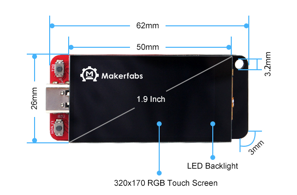
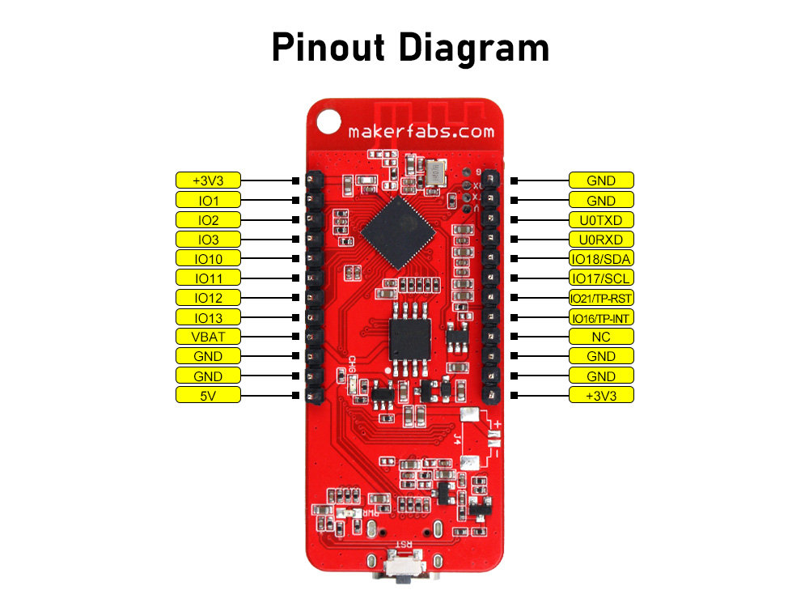
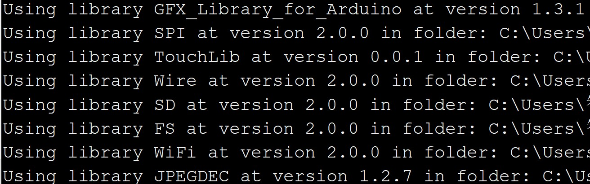
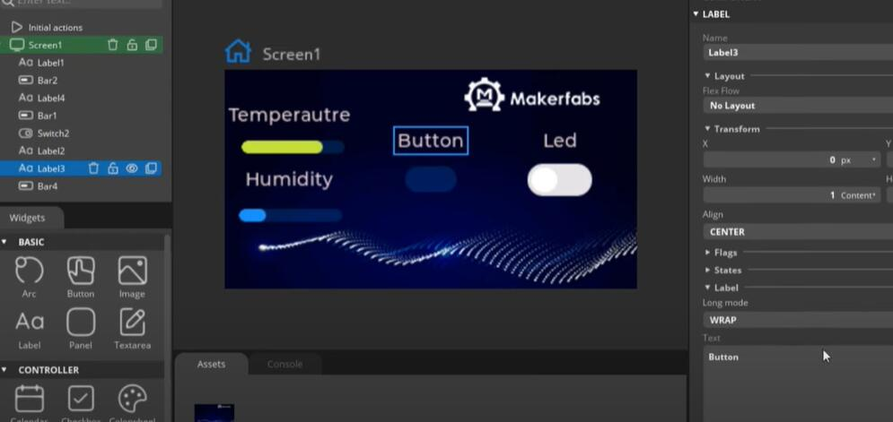
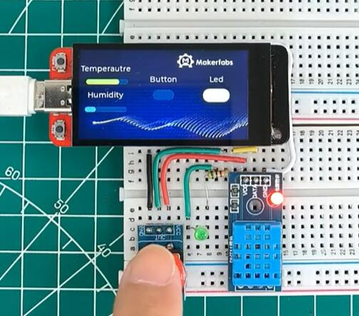

MaTouch 1.9“ TFT Breakout

```c++
/*
Version:		V1.1
Author:		Charlin
Create Date:	2023/8/14
Note:


*/
```



# Makerfabs

[Makerfabs home page](https://www.makerfabs.com/)

[Makerfabs Wiki](https://wiki.makerfabs.com/)

## Intruduce

Product Link:[MaTouch 1.9“ TFT Breakout](https://www.makerfabs.com/MaTouch-1.9-inch-TFT-Breakout.html)

Wiki Link : []()

Makerfabs MaTouch 1.9” has got lots of interests, but we got many feedback that there the ESP32S3 pins should be breakout, for users’ application, so we designed this new board.

Compares to the old version, there main updates are the GPIO all been breakout, users can prototype it more easily with a breadboard, or use it as a “controller” for other boards by inserting it to other boards.

## Features

Specs:
- Controller: ESP32-S3
- Wireless: WiFi& Bluetooth 5.0
- LCD: 1.9", 320x170 resolution, driver ST7789V2
- LCD interface: 8 bit 8080
- Touch Panel Driver: CST816D
- USB: USB Native, Type-C
- Power Supply: USB Type-C 5.0V(4.0V~5.25V); 3.7V Lipo battery
- Button: Flash button and reset button
- MicroSD: Yes
- Arduino support: Yes
- MicroPython support: Yes
- Operation temperature: -40℃ to +85℃




# Usage

## Libraries

Related library versions



- Use type-c use cable connect USB-TTL to PC.
- Select "ESP32-S3 DEV Module"
- Select PSRAM "OPI PSRAM"

"mf_Lvgl" library is modified from Lvgl library (version 8.3.2). 

Please unzip "lib/mf_Lvgl.zip"."TouchLib" and copy to arduino library directory.


## Example

### firmware

Factory test program


### squareline_demo

SquareLine demo, connected DHT11 sensor, button, LED.

[Youtube](https://www.youtube.com/watch?v=VayIuLey8po&t=3s)



